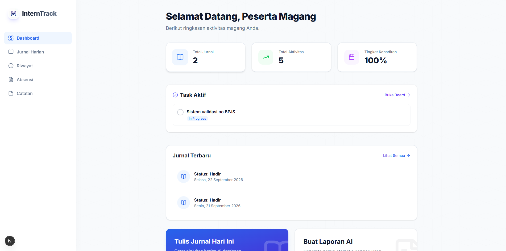
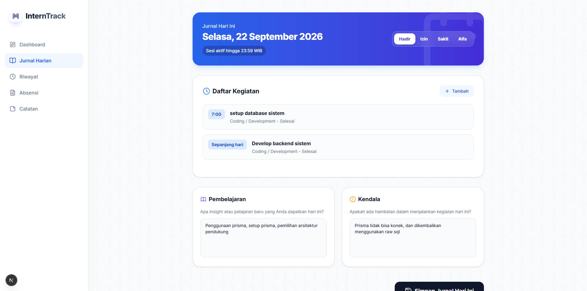
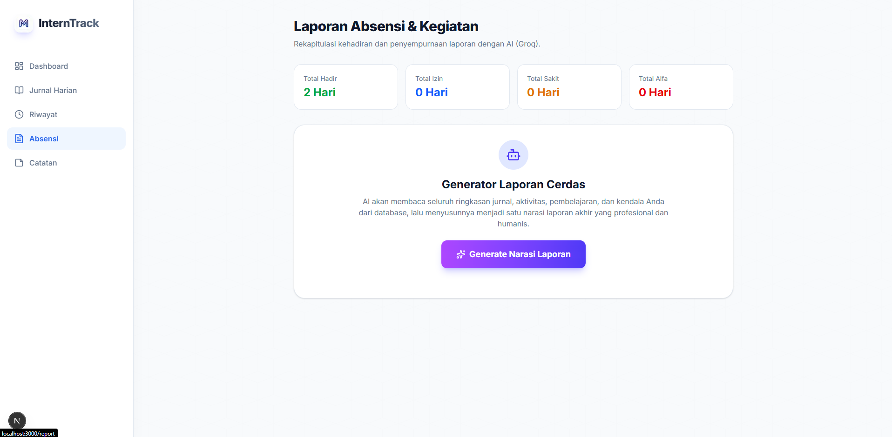

# InternTrack 🚀

**InternTrack** (Monev Magang) adalah aplikasi web komprehensif yang dirancang untuk memonitor, mencatat, dan mengevaluasi aktivitas magang secara efisien. Dibangun dengan menggunakan teknologi modern (Next.js & Supabase) serta ditenagai oleh kecerdasan buatan (Groq AI), aplikasi ini menyederhanakan proses pelaporan magang menjadi lebih bermakna, profesional, dan humanis.

---

## ✨ Fitur Utama

### 1. 📊 Dashboard Cerdas & Task Widget
Memantau statistik absensi dan progres magang dalam satu lirikan. Dilengkapi dengan widget **Task Aktif** untuk mencentang tugas (To Do / In Progress) secara langsung dari beranda.



### 2. 📝 Jurnal Harian (Daily Log) Terintegrasi
Catat kehadiran (Hadir, Izin, Sakit, Alfa), daftar kegiatan berdasarkan jam, rincian pembelajaran harian, hingga kendala yang dihadapi. Mendukung penambahan multi-aktivitas secara *real-time*.



### 3. 🤖 Generator Laporan AI (Groq AI)
Tidak perlu repot merangkai kata untuk laporan bulanan/mingguan. Sistem akan secara otomatis mengkompilasi seluruh jurnal harian, kegiatan, dan kendala, lalu menggunakan kecerdasan buatan (Groq AI) untuk menyusun narasi laporan akhir yang profesional namun tetap humanis.



### 4. 📋 Kanban Task Board & Catatan (Notion-like)
Sistem manajemen catatan dan tugas terintegrasi:
- **Grid View**: Menyimpan ide, materi, dan *keyword* penting.
- **Kanban Board**: Melacak progres tugas (*To Do*, *In Progress*, *Done*).

### 5. 📱 PWA & Mobile-First UX
Aplikasi didesain khusus agar sangat nyaman dibuka melalui *smartphone*. Mendukung fitur **PWA (Progressive Web App)** sehingga dapat di-*install* di *homescreen* HP layaknya aplikasi *Native* (Lengkap dengan Web App Manifest dan Custom App Icon).

---

## 🛠️ Tech Stack

- **Framework**: [Next.js 14 (App Router)](https://nextjs.org/)
- **Styling**: [Tailwind CSS](https://tailwindcss.com/)
- **Database / BaaS**: [Supabase (PostgreSQL)](https://supabase.com/)
- **AI Integration**: [Groq API](https://groq.com/) (menggunakan model open-source)
- **UI Components & Icons**: [Lucide React](https://lucide.dev/), [React Hot Toast](https://react-hot-toast.com/)

---

## 🚀 Panduan Instalasi Lokal

1. **Clone repositori ini:**
   ```bash
   git clone https://github.com/farhanmunada/monev-maggang.git
   cd monev_maggangV2
   ```

2. **Instal dependensi:**
   ```bash
   npm install
   ```

3. **Atur Variabel Lingkungan (.env.local):**
   Buat file `.env.local` di *root directory* dan masukkan konfigurasi berikut:
   ```env
   NEXT_PUBLIC_SUPABASE_URL=your_supabase_url
   NEXT_PUBLIC_SUPABASE_ANON_KEY=your_supabase_anon_key
   GROQ_API_KEY=your_groq_api_key
   ```

4. **Jalankan Server:**
   ```bash
   npm run dev
   ```
   Akses `http://localhost:3000` di browser Anda.

---
*Dibuat untuk menyederhanakan administrasi magang. Happy Coding!* 🎯
